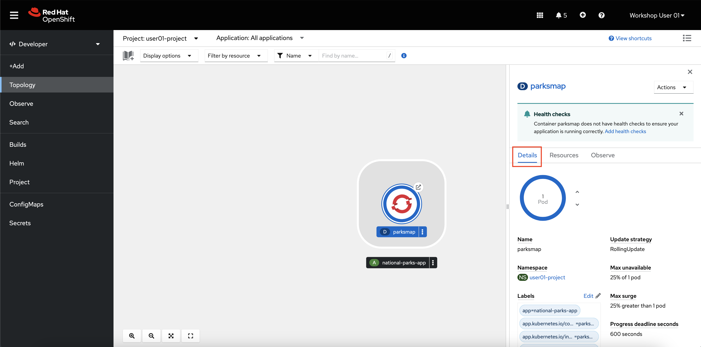
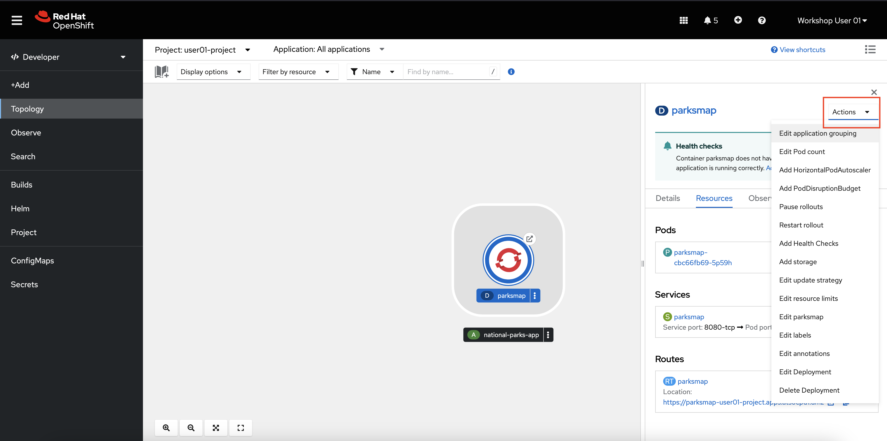
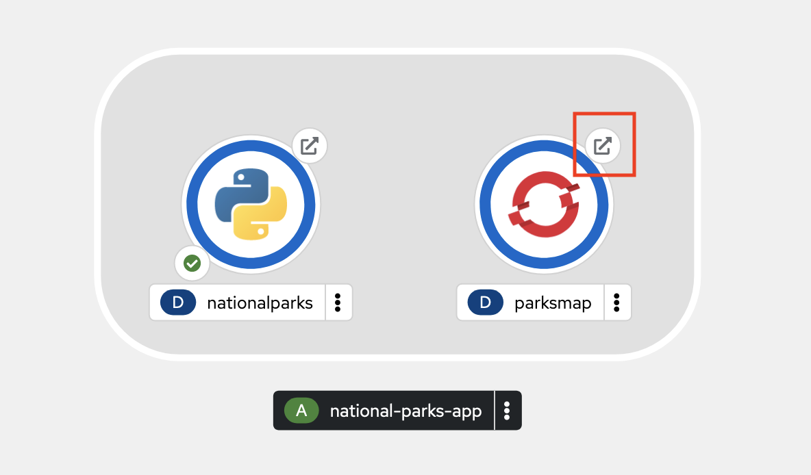
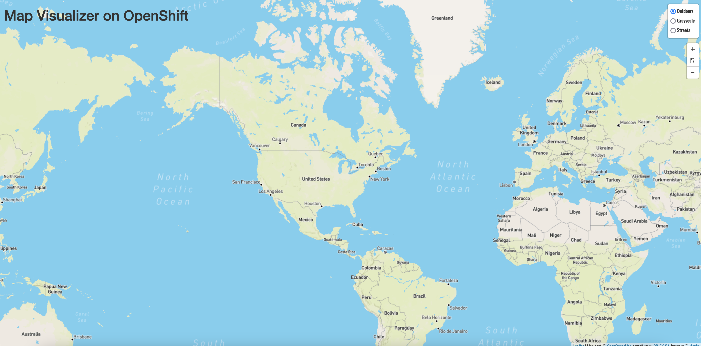
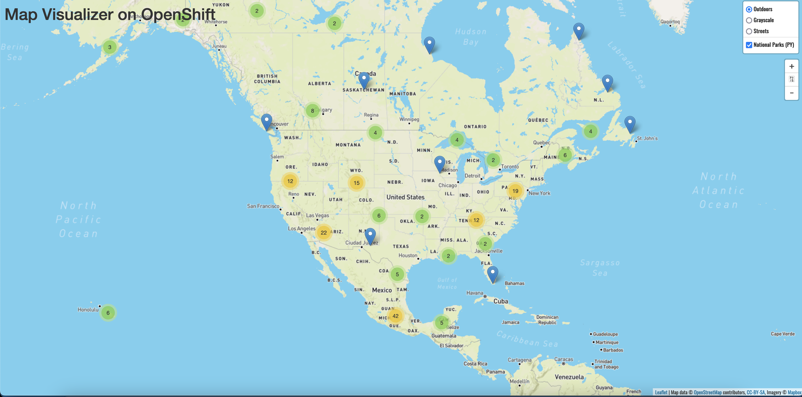

# openshift-intro
 
In this tutorial, you will walk through an intoduction to OpenShift Container Platform (OCP) from both the web console and the OpenShift command line interface, `oc`. This tutorial is based on the [Getting Started](https://docs.openshift.com/container-platform/4.12/getting_started/openshift-web-console.html) portion of the OpenShift Container Platform documentation, but modified to run on various platform architectures (including IBM zSystems, IBM Power, and x86) as well as adding more explanations for the concepts it contains.

## Pre-Requisites
1. Access to an OpenShift cluster
2. `oc` CLI [installed](https://docs.openshift.com/container-platform/4.12/cli_reference/openshift_cli/getting-started-cli.html)
3. Projects created for each user with the names `userNN-project` (`NN` being each user number). Administrators can create this ahead of time with any limitations or quotas they wish, or administrators can allow users to create their own projects.

## OpenShift Overview

OpenShift Container Platform is a cloud-based Kubernetes container platform. The foundation of OpenShift Container Platform is based on Kubernetes and therefore shares the same technology. It is designed to allow applications and the data centers that support them to expand from just a few machines and applications to thousands of machines that serve millions of clients.

OpenShift Container Platform enables you to do the following:

- Provide developers and IT organizations with cloud application platforms that can be used for deploying applications on secure and scalable resources.
- Require minimal configuration and management overhead.
- Bring the Kubernetes platform to customer data centers and cloud.
- Meet security, privacy, compliance, and governance requirements.

With its foundation in Kubernetes, OpenShift Container Platform incorporates the same technology that serves as the engine for massive telecommunications, streaming video, gaming, banking, and other applications. Its implementation in open Red Hat technologies lets you extend your containerized applications beyond a single cloud to on-premise and multi-cloud environments.

**OpenShift Container Platform**, commonly referred to as OCP, is a Kubernetes environment for managing the lifecycle of container-based applications and their dependencies on various computing platforms, such as bare metal, virtualized, on-premise, and in cloud. OpenShift Container Platform deploys, configures and manages containers. OpenShift Container Platform offers usability, stability, and customization of its components.

OpenShift Container Platform utilises a number of computing resources, known as nodes. A node has a lightweight, secure operating system based on Red Hat Enterprise Linux (RHEL), known as Red Hat Enterprise Linux CoreOS (RHCOS).

After a node is booted and configured, it obtains a container runtime, such as CRI-O or Docker, for managing and running the images of container workloads scheduled to it. The Kubernetes agent, or kubelet schedules container workloads on the node. The kubelet is responsible for registering the node with the cluster and receiving the details of container workloads.

OpenShift Container Platform configures and manages the networking, load balancing and routing of the cluster. OpenShift Container Platform adds cluster services for monitoring the cluster health and performance, logging, and for managing upgrades.

The container image registry and OperatorHub provide Red Hat certified products and community built softwares for providing various application services within the cluster. These applications and services manage the applications deployed in the cluster, databases, frontends and user interfaces, application runtimes and business automation, and developer services for development and testing of container applications.

You can manage applications within the cluster either manually by configuring deployments of containers running from pre-built images or through resources known as Operators. You can build custom images from pre-build images and source code, and store these custom images locally in an internal, private or public registry.

## Overview of the OpenShift Web Console

The OpenShift Container Platform web console is a user interface accessible from a web browser.

Developers can use the web console to [visualize, browse, and manage the contents of projects](https://docs.openshift.com/container-platform/4.12/web_console/odc-about-developer-perspective.html).


Administrators can use the web console to manage and monitor applications running on the cluster, [along with the cluster itself](https://docs.openshift.com/container-platform/4.12/web_console/using-dashboard-to-get-cluster-information.html).


[The web console can be customized](https://docs.openshift.com/container-platform/4.12/web_console/configuring-web-console.html) to suit an organization's needs, and when you log into the web console, you will only see the cluster resources that are available to you as allowed by the OpenShift Role Based Access Control (RBAC).

The web console runs as a group of pods on the control plane nodes in the `openshift-console` project, along with a service exposed as a route. Like any other OpenShift applicationm the service is an internal load balancer that directs traffic to one of the OpenShift console pods. The route is what allows external access into the service, and it is the address you connect to when accessing the OpenShift web console.

The OpenShift web console is a great example of how OpenShift itself is managed the same way as any other application running on the cluster.

## Connect to the OpenShift Console

1. **Open a web browser such as Firefox or Google Chrome.**

2. In the browser, **navigate to your OpenShift console.** 

    The OpenShift console typically begins with `https://console-openshift-console-`. Reach out to your OpenShift administrator if you do not have this address

    You will now see the OpenShift console login page.

    

3. **Log in with your OpenShift credentials.**

## The Administrator Perspective

Take a moment to notice the following elements in the navigation bar:


Note: These buttons display on each page of the OpenShift console. Note that the Applications button might be missing from your screen, depending on your credentials and which applications are currently deployed on the cluster.

By default, the menu on the left side of the page should be activated and displaying the cluster menu.

4. In the left-side menu, **select the Administrator perspective** if it isn't already showing.

    

    With the administrator menu showing, you are provided with a broad range of options to manage the OpenShift cluster and the applications running on it.

    

    The *Administrator* perspective is the default view for the OpenShift console for users who have an administrative access level. This perspective provides visibility into options related to cluster administration, the cluster operators running the OpenShift cluster itself, as well as a broader view of the projects associated with the currently logged-in user.

    Your user credentials have the `cluster-reader` roleBinding. This is a read-only roleBinding that allows you to *see* most of what OpenShift has to offer administrators without allowing you to modify cluster objects. For example, typical non-admin users would not be able to complete the following few steps.

5. In the menu at the very bottom, click Administration -> Cluster Settings.

    

    The cluster settings page is where administrators can see what OpenShift versions are available, and also update the cluster from within the console. OpenShift completely automates the a cluster update once triggered by an administrator, including updating all of the clustser operators and the CoreOS operating system running on the nodes.

6. On the Cluster Settings page, select the ClusterOperators tab.

    

    Each clusterOperator is responsible for managing resources related to a specific OpenShift function. For example, the `authentication` clusterOperator manages all of the resources (pods, routes, secrets, etc.) related to the LDAP authentication you are using to log in with the `userNN` username.

7. In the Menu, **click Home -> Projects.**

    

    The rest of the page is populated by projects. A project has been created for you to work in named `userNN-project` (where NN is your user number). If your OpenShift administrator did not create this project for you, you should be able to do so yourself with the `Create Project` button in the top right of the projects page.

    Any project starting with `openshift-` or `kube-` contain the workloads running the OpenShift platform itself.

8. **Click the userNN-project hyperlink** (where NN is your user number).

    Tip: With so many Projects displayed, you can use the search bar to find yours more easily.

    You will now see the Dashboard for your project.

    

9.  **Look through the Overview tab of your project**.

    This displays information about what’s going on in your project, such as CPU and memory usage, any alerts or crashlooping pods, an inventory of all the Kubernetes resources deployed in the project, and more. You won’t see much information yet, as no workloads should be running in this project.

10. **Click the Workloads tab** to the right of YAML.

    This page displays all of the workloads in your project, so it’s empty for now.

    All objects in OpenShift can be generated using YAML files. YAML (standing for Yet Another Markup Language) is a human-readable language for configuration files. Most OpenShift object such as Deployments, Services, Routes, etc. can be modified by directly editing their YAML file in either the console or command line.

    Workloads are typically created by developers, so in the next section, you will swap to the developer perspective to deploy a an application. You will return to the administrator perspective later in this lab.

## The Developer Perspective

1. In the left-side Menu, **click the Administrator dropdown, and select Developer**.

    

    The *Developer* perspective provides views and workflows specific to developer use cases, while hiding many of the cluster management options typically used by administrators. This perspective provides developers with a streamlined view of the options they typically use.

    

Switching to the Developer perspective takes you to the *Topology* view. If no workloads are deployed in the selected project, options to start building an application or visit the +Add page or are displayed.

If you ended up on a page other than Topology, continue with step 1 below anyways.

1. **Click the +Add button in the menu**.

    

    There are multiple methods of deploying workloads from the OpenShift web browser, including from raw source code hosted in a Git repository, from a pre-built container image, or from an operator.

## Deploying a Container Image

The simplest way to deploy an application in OpenShift Container Platform is to run an existing container image. The following procedure deploys a front end component of an application called `national-parks-app`. The web application displays an interactive map which shows the location of national parks across North America.

1. From the +Add view in the Developer perspective, click Container images.

2. Enter the following values:

    - Image name from external registry: `quay.io/mmondics/national-parks-frontend:latest`
    - Application name: `national-parks-app`
    - Name: `parksmap`

    Keep the default target port as well as the route option checked.

    In the Advanced Options section, click Labels and add labels to better identify this deployment later. Labels help identify and filter components in the web console and in the command line. Add the following labels:

    - `app=national-parks-app`
    - `component=parksmap`
    - `role=frontend`

    Note: you can hit the `enter` or `tab` key to enter each individual label.

1. Click Create.

    You are redirected to the Topology page where you will shortly see the `parksmap` deployment in the `national-parks-app` application.

    

## Examining the Pod

The topology page gives you a visual representation of your application where you can view and monitor its components.

1. Click the circular icon for your `parksmap` deployment.

    This brings up a window on the right side of the screen with more options for the deployment.
    
2. Click the details tab, if not already on it. 
 
    

   Here you can manage its properties including number of copies, labels, or storage.

1. Click the Resources tab. 

    

    Here you can access the pod or its logs as well as the route where the application is accessible.

2. Click the Actions dropdown menu.

    

    This menu provides many options for how to manage or modify your `parksmap` deployment. Most of these options can be set either at the time you deploy the application, or afterwards as in this case.

## Scaling the Frontend Application

In Kubernetes, a Deployment object defines how an application deploys. In most cases, users use Pod, Service, ReplicaSets, and Deployment resources together. As in the previous section, OpenShift Container Platform creates each of these dependent resources for you, rather than you having to configure each one manually.

When you deployed the `national-parks-frontend` image, a deployment resource was created with only one pod deployed. However, in most cases, users will want to scale their application to have multiple copies running at the same time. This is one of the core features of Kubernetes and OpenShift that build a more highly available application buy creating multiple copies of it across different physical or virtual hosts.

1. On the details tab for the `parksmap` deployment, click the up arrow next to the blue circle that says `1 pod`. 

    

    This scales your application from one pod to two pods.

    

    This is a simple demonstration of horizontal scaling with Kubernetes. You now have two instances of your pod running in the OpenShift cluster. Traffic to the `parksmap` application will now be distributed to each pod, and if for some reason a pod is lost, that traffic will be redistributed to the remaining pods until a Kubernetes starts another. If a whole compute node is lost, Kubernetes will move the pods to different compute nodes.

    OpenShift and Kubernetes also support [horizontal autoscaling](https://docs.openshift.com/container-platform/4.12/nodes/pods/nodes-pods-autoscaling.html) of pods based on CPU or memory consumption, but that is outside the scope of this lab.

Now that you are more familiar with the OpenShift web console, the next section will introduce you to the OpenShift command line interface (CLI) `oc`. You will use the `oc` CLI to deploy a backend python application to serve data to the frontend `parksmap` as well as to deploy a containerized MongoDB application.

## Introduction to the `oc` CLI

The `oc` CLI is an incredibly powerful tool to manage OpenShift clusters and applictions. It is capable of performing any task you can do in the web console, and some tasks are only possible to do with `oc`.

`oc` is ideal in situations where you:

- Work directly with project source code.
- Script OpenShift Container Platform operations.
- Are restricted by bandwidth resources and cannot use the web console.

Furthermore, many people familiar with Linux and/or Kubernetes tend to find the `oc` command line an easier and more efficient method of performing tasks, rather than the web-based console.

Like with the OpenShift web console, the OpenShift command line includes functions both [for developers](https://docs.openshift.com/container-platform/4.12/cli_reference/openshift_cli/developer-cli-commands.html) and for [administrators](https://docs.openshift.com/container-platform/4.12/cli_reference/openshift_cli/administrator-cli-commands.html).

For those who are familiar with Kubernetes and its `kubectl` CLI tool, the `oc` tool is essentially analagous but with additional features.

## Logging in with the `oc` CLI

The frontend application, `parksmap`, needs a backend. In this section, you will deploy a python application named `nationalparks`. This application performs 2D geo-spatial queries against a MongoDB database to locate and return map coordinates of all national parks in North America.

1. From the OpenShift web console, click your username in the top right corner (i.e. `Workshop User NN`) and select `Copy login command`.

    

1. Log in with your OpenShift credentials and click the Display Token hyperlink.

1. Copy the line that begins with `oc login`, paste it into a terminal session, and execute the command.

    Sample output: 

    ```
    $ oc login --token=uL3fHEPSGH3io0kljsgRfAMAPIIY44BhwnGxCMA3dei4 --server=https://api.example.com:6443
    Logged into "https://api.example.com:6443" as "user01" using the token provided.

    You have access to 161 projects, the list has been suppressed. You can list all projects with 'oc projects'

    Using project "user01-project".
    ```

    You are now logged into the cluster via the `oc` CLI, and you are told which project you are using.

    If you’re in a project other than your own `userNN-project`, use the following command to move into it: `oc project userNN-project`, where `NN` is your user number.

## Exploring the `oc` CLI

1. In your terminal, test out the `oc` CLI.

    ```text
    oc --help
    ```

    Sample output: 

    ```
    user01@lab061:~$ oc --help
    OpenShift Client

    This client helps you develop, build, deploy, and run your applications on any
    OpenShift or Kubernetes cluster. It also includes the administrative
    commands for managing a cluster under the 'adm' subcommand.

    Usage:
    oc [flags]

    Basic Commands:
    login           Log in to a server
    new-project     Request a new project
    new-app         Create a new application
    status          Show an overview of the current project
    project         Switch to another project
    projects        Display existing projects
    explain         Documentation of resources

    Build and Deploy Commands:
    rollout         Manage a Kubernetes deployment or OpenShift deployment config
    rollback        Revert part of an application back to a previous deployment
    new-build       Create a new build configuration
    start-build     Start a new build
    ```

    The `--help` flag will display all of the available options the oc CLI.

2. **Enter the following command**

    ```text
    oc new-app --help
    ```

    Sample output:

    ```
    user01@lab061:~$ oc new-app --help
    Create a new application by specifying source code, templates, and/or images

    This command will try to build up the components of an application using images, templates, or code
    that has a public repository. It will lookup the images on the local Docker installation (if
    available), a container image registry, an integrated image stream, or stored templates.

    If you specify a source code URL, it will set up a build that takes your source code and converts
    it into an image that can run inside of a pod. Local source must be in a git repository that has a
    remote repository that the server can see. The images will be deployed via a deployment
    configuration, and a service will be connected to the first public port of the app. You may either
    specify components using the various existing flags or let new-app autodetect what kind of
    components you have provided.

    If you provide source code, a new build will be automatically triggered. You can use 'oc status' to
    check the progress.

    Usage:
    oc new-app (IMAGE | IMAGESTREAM | TEMPLATE | PATH | URL ...) [flags]

    Examples:
    # List all local templates and image streams that can be used to create an app
    oc new-app --list
    
    # Create an application based on the source code in the current git repository (with a public
    remote) and a Docker image
    oc new-app . --docker-image=repo/langimage
    ```

    The `--help` flag now displays all of the available options for the oc new-app command. If you get confused about any of the commands we use in this workshop, or just want more information, using this flag is a good first step.

`oc new-app` is a powerful and commonly used command in the OpenShift CLI. It has the ability to deploy applications from components that include:

- Source or binary code
- Container images
- Templates

The set of objects created by `oc new-app` depends on the artifacts passed as an input.

## Use `oc` to Deploy a Python Application from Source Code

The frontend application, `parksmap`, needs a backend. In this section, you will deploy a python application named `nationalparks`. This application performs 2D geo-spatial queries against a MongoDB database to locate and return map coordinates of all national parks in North America.

1. Deploy the python backend with the following `oc new-app` command.

    ```text
    oc new-app python~https://github.com/mmondics/national-parks --context-dir source/nationalparks-py --name nationalparks -l 'app=national-parks-app,component=nationalparks,role=backend,app.kubernetes.io/part-of=national-parks-app,app.kubernetes.io/name=python'
    ```

    A few things to notice about this command:

    - The `oc new-app` command is not being run against a specific container image. It is being run against python *source code* that exists in GitHub [here](https://github.com/mmondics/national-parks/tree/main/source/nationalparks-py). Although a Dockerfile exists in the directory, it is not being used due to the `pyhon~` option in the command. OpenShift is using its *source-to-image* capability to create its own Dockerfile and containerize the application from its source code. If you wanted to, you could have omitted the `python~` option and OpenShift would use the Dockerfile in the directory.
    - `--name` flag provides the name for the python Deployment
    - `-l` sets the following key=value pairs as labels on the deployment
    
    Sample Output:

    ```text
    ➜  ~ oc new-app python~https://github.com/mmondics/national-parks --context-dir source/nationalparks-py --name nationalparks -l 'app=national-parks-app,component=nationalparks,role=backend,app.kubernetes.io/part-of=national-parks-app,app.kubernetes.io/name=python'
    warning: Cannot check if git requires authentication.
    --> Found image ad4c417 (2 weeks old) in image stream "openshift/python" under tag "3.9-ubi8" for "python"

        Python 3.9
        ----------
        Python 3.9 available as container is a base platform for building and running various Python 3.9 applications and frameworks. Python is an easy to learn, powerful programming language. It has efficient high-level data structures and a simple but effective approach to object-oriented programming. Python's elegant syntax and dynamic typing, together with its interpreted nature, make it an ideal language for scripting and rapid application development in many areas on most platforms.

        Tags: builder, python, python39, python-39, rh-python39

        * A source build using source code from https://github.com/mmondics/national-parks will be created
        * The resulting image will be pushed to image stream tag "nationalparks:latest"
        * Use 'oc start-build' to trigger a new build

    --> Creating resources with label app=national-parks-app,app.kubernetes.io/name=python,app.kubernetes.io/part-of=national-parks-app,component=nationalparks,role=backend ...
        imagestream.image.openshift.io "nationalparks" created
        buildconfig.build.openshift.io "nationalparks" created
    Warning: would violate PodSecurity "restricted:v1.24": allowPrivilegeEscalation != false (container "nationalparks" must set securityContext.allowPrivilegeEscalation=false), unrestricted capabilities (container "nationalparks" must set securityContext.capabilities.drop=["ALL"]), runAsNonRoot != true (pod or container "nationalparks" must set securityContext.runAsNonRoot=true), seccompProfile (pod or container "nationalparks" must set securityContext.seccompProfile.type to "RuntimeDefault" or "Localhost")
        deployment.apps "nationalparks" created
        service "nationalparks" created
    --> Success
        Build scheduled, use 'oc logs -f buildconfig/nationalparks' to track its progress.
        Application is not exposed. You can expose services to the outside world by executing one or more of the commands below:
        'oc expose service/nationalparks'
        Run 'oc status' to view your app.
    ```

    The output from the `oc new-app` command tells you what all was created - an imagestream, buildconfig, deployment, and service. 

    The buildconfig is the configuration file that will be used to build the `nationalparks` container image. This build will automatically begin, and you can check its logs to watch the process. 

1. Check the `nationalparks` build log.
   
    ```text
    oc logs build/nationalparks-1
    ```

    Once you see `Push successful` at the end of the build logs, your new container image has been built and pushed into OpenShift's internal registry. It will then automatically be deployed in a pod.

1. Check that the `nationalparks` pod is running and ready.

    ```text
    oc get pods
    ```

    Sample output:

    ```text
    ➜  ~ oc get pods
    NAME                             READY   STATUS      RESTARTS   AGE
    nationalparks-1-build            0/1     Completed   0          19m
    nationalparks-67b69fc9b7-z5znq   1/1     Running     0          18m
    parksmap-cbc66fb69-c87k7         1/1     Running     0          64s
    ```

    Once the `nationalparks` pod is `Running` and has `1/1` containers ready, the application is successfully deployed. However, the backend python application is only accessible from within the OCP cluster. It is exposed to the outside world, as you may have noticed from the output of the `oc new-app` command: `Application is not exposed. You can expose services to the outside world by executing one or more of the commands below:`

1. Create a route that exposes the `nationalparks` service.

    ```text
    oc expose service/nationalparks
    ```

1. See the new route that was created.

    ```text
    oc get route
    ```

    Sample output:

    ```text
    ➜  ~ oc get routes
    NAME            HOST/PORT                                        PATH   SERVICES        PORT       TERMINATION     WILDCARD
    nationalparks   nationalparks-user01-project.apps.example.com          nationalparks   8080-tcp                   None
    parksmap        parksmap-user01-project.apps.example.com               parksmap        8080-tcp   edge/Redirect   None
    ```

1. Label the `nationalparks` route as the application backend.

    ```text
    oc label route nationalparks type=parksmap-backend
    ```

2. Navigate to the frontend `parksmap` route in a web browser. Use the `parksmap` `HOST/PORT` value from the `oc get routes` command preceded by `http://`.

    e.g. <http://parksmap-userNN-project.apps.example.com>

    Alternatively, you can click the small arrow button associated with the `parksmap` deployment in the OpenShift web console topology.

    

    Any way that you get there, your application should display the image below:

    

    You should see a map of the world, but you will not see any icons for National Parks yet. That's because we have one more application to deploy and configure - the MongoDB database that will store all of the data about National Parks and their locations.

## Deploying and Configuring MongoDB

The MongoDB you will deploy in this section will store all information about the National Parks, their names and coordinates.

1. Deploy the MongoDB container.

    ```text
    oc new-app quay.io/mmondics/mongodb:latest --name mongodb-nationalparks -e MONGODB_USER=mongodb -e MONGODB_PASSWORD=mongodb -e MONGODB_DATABASE=mongodb -e MONGODB_ADMIN_PASSWORD=mongodb -l 'app.kubernetes.io/part-of=national-parks-app,app.kubernetes.io/name=mongodb'
    ```

    A few things to notice about this command:

    - You're deploying a pre-built container image hosted at quay.io/mmondics/mongodb. 
    - `--name` sets the name of the MongoDB deployment
    - `-e` sets environment variables within the resulting container. These can be used like any other environment variable when the container is running, and you can see them by connecting to the pod and running the `env` command
    - `-l` sets labels for this deployment

    Once again, you can check `oc get pods` to see when the MongoDB pod is ready.

    ```text
    NAME                                     READY   STATUS      RESTARTS   AGE
    mongodb-nationalparks-5d8b6f99f7-4wwst   1/1     Running     0          8s
    nationalparks-1-build                    0/1     Completed   0          58m
    nationalparks-67b69fc9b7-z5znq           1/1     Running     0          56m
    parksmap-cbc66fb69-c87k7                 1/1     Running     0          39m
    ```

    Now, you may think that you are ready to look at your frontend application again to see the backend data. However, this MongoDB requires authentication before it can be used, so in the next section, you will provide sensitive information to the application using OpenShift *secrets*.

## Providing Sensitive Application with Secrets

The *Secret* object provides a mechanism to hold sensitive information such as passwords, OpenShift Container Platform client configuration files, private source repository credentials, and so on. Secrets decouple sensitive content from the pods. You can mount secrets into containers using a volume plugin or the system can use secrets to perform actions on behalf of a pod. The following procedure adds the secret `nationalparks-mongodb-parameters` and mounts it to the `nationalparks` workload.

1. Create a secret holding sensitive information (usernames and passwords).

    ```text
    oc create secret generic nationalparks-mongodb-parameters --from-literal=DATABASE_SERVICE_NAME=mongodb-nationalparks --from-literal=MONGODB_USER=mongodb --from-literal=MONGODB_PASSWORD=mongodb --from-literal=MONGODB_DATABASE=mongodb --from-literal=MONGODB_ADMIN_PASSWORD=mongodb
    ```

1. Update the environment variable to attach the `nationalparks-mongodb-parameters` secret to the `nationalpartks` workload.

    ```text
    oc set env --from=secret/nationalparks-mongodb-parameters deploy/nationalparks
    ```

    The `nationalparks` deployment will notice that a change has been made, and it will create a new pod with these changes applied. Check with `oc get pods` until the new pod is up and running.

2. Once the `mongodb-nationalparks` pod is running and ready, run the following command to load National Park data into MongoDB.

    **Make sure that you are in your own project before running the command.**

    ```text
    oc exec $(oc get pods -l component=nationalparks | tail -n 1 | awk '{print $1;}') -- curl -s http://localhost:8080/ws/data/load
    ```

    If you see `"Items inserted in database: 226"`, the data was successfully loaded.

2. Finally, return to your frontend `parksmap` application in a web browser.

    

