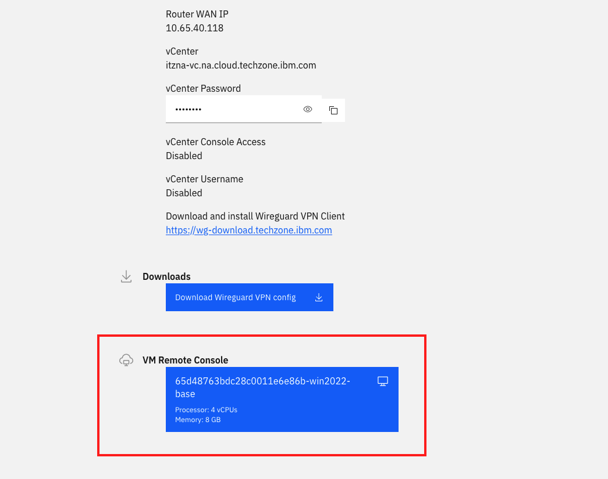
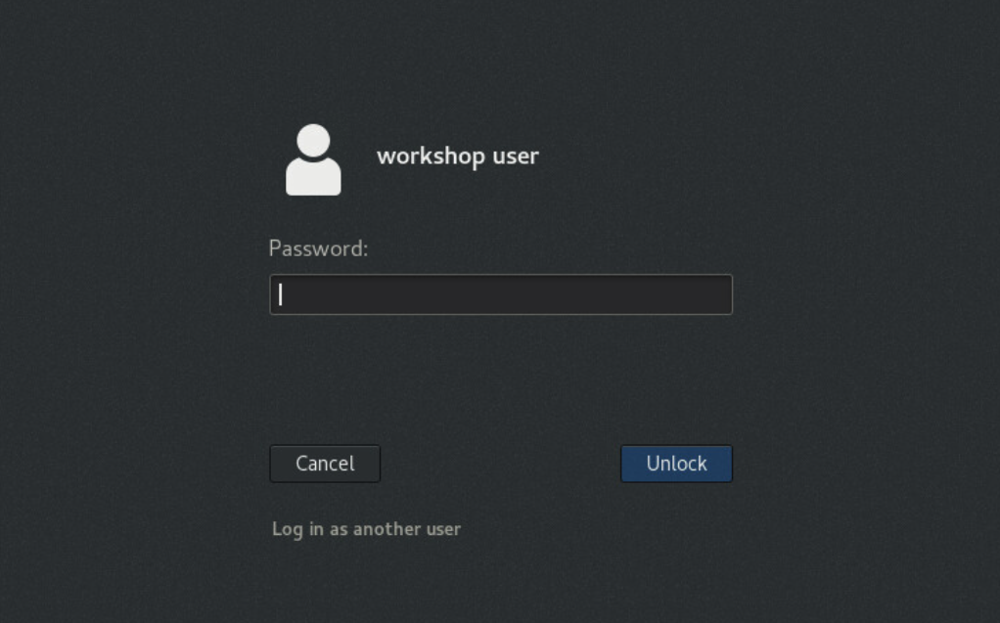

# Accessing the Environment

## Accessing your Virtual Machine
1. Access the workshop Attendee URL [here](https://techzone.ibm.com/my/workshops/student/66ede03a7a59711899285bfa)
2. Log in with your IBM ID.
   1. If you don't already have an IBM ID, you will need to create one [here](https://www.ibm.com/account/reg/us-en/signup?formid=urx-19776&target=https%3A%2F%2Flogin.ibm.com%2Foidc%2Fendpoint%2Fdefault%2Fauthorize%3FqsId%3Db9977aed-1e6b-4321-9b43-ee4365544452%26client_id%3DODllMDk4YzItMjgxOC00)
3. When prompted, enter the workshop password: `password`
4. Open your virtual machine using the big blue button under 'VM Remote Console'.

   
   
5. Log into the RHEL virtual machine with password: `p@ssw0rd` (that's a zero). You may already be logged in when first accessing the VM.

   

   You may need to hit your `Enter` key to reach the login page.

If you run into an issue where your mouse pointer is not visible, try to open the Virtual Machine in a different browser. If that doesn't work, try to open the VM in a new window with the button in the top right of the VM.

Please do not log off or reboot the Virtual Machine, as that will disconnect the VPN.

## Accessing OpenShift web console
1. Go to the OpenShift Cluster here: <https://console-openshift-console.apps.atsocppa.dmz/dashboards>
2. Use your credentials in the table below. 

## Accessing OpenShift CLI
To access OpenShift via the CLI, you must first `ssh` to one of our WSC Linux guests from the Windows Virtual Machine.

```text
ssh userNN@192.168.176.61
```

Then paste your `oc login` command.

<!---
## Links to platforms
- OpenShift Cluster URL: <https://console-openshift-console.apps.atsocpd1.dmz/dashboards>
- Instana URL: <https://lcsins01.dmz/#/home>
- Turbonomic URL: <https://nginx-turbonomic-platform.apps.x2pn.dmz/app/>
- IBM Cloud Pak for Watson AIOps URL: <https://cpd-cp4waiops.apps.x2pn.dmz/zen/#/homepage>

If you cannot access the webpage for any of the platforms above, check that the Cisco Secure Client VPN is logged in on the Virtual Machine. If it is no longer logged in, please let the lab administrator know.
--->

## OpenShift credentials

You can find your Environment Number on the TechZone Workshop page in the 'Your Environment' section.


| Environment Number | NN | Username | Password |
|-----|----|--------------------|--------------------|
| 1 | 01 | `user01` | `p@ssw0rd` |
| 2 | 02 | `user02` | `p@ssw0rd` |
| 3 | 03 | `user03` | `p@ssw0rd` |
| 4 | 04 | `user04` | `p@ssw0rd` |
| 5 | 05 | `user05` | `p@ssw0rd` |
| 6 | 06 | `user06` | `p@ssw0rd` |
| 7 | 07 | `user07` | `p@ssw0rd` |
| 8 | 08 | `user08` | `p@ssw0rd` |
| 9 | 09 | `user09` | `p@ssw0rd` |
| 10 | 10 | `user10` | `p@ssw0rd` |
| 11 | 11 | `user11` | `p@ssw0rd` |
| 12 | 12 | `user12` | `p@ssw0rd` |
| 13 | 13 | `user13` | `p@ssw0rd` |
| 14 | 14 | `user14` | `p@ssw0rd` |
| 15 | 15 | `user15` | `p@ssw0rd` |
| 16 | 16 | `user16` | `p@ssw0rd` |
| 17 | 17 | `user17` | `p@ssw0rd` |
| 18 | 18 | `user18` | `p@ssw0rd` |
| 19 | 19 | `user19` | `p@ssw0rd` |
| 20 | 20 | `user20` | `p@ssw0rd` |
| 21 | 21 | `user21` | `p@ssw0rd` |
| 22 | 22 | `user22` | `p@ssw0rd` |
| 23 | 23 | `user23` | `p@ssw0rd` |
| 24 | 24 | `user24` | `p@ssw0rd` |
| 25 | 25 | `user25` | `p@ssw0rd` |
| 26 | 26 | `user26` | `p@ssw0rd` |
| 27 | 27 | `user27` | `p@ssw0rd` |
| 28 | 28 | `user28` | `p@ssw0rd` |
| 29 | 29 | `user29` | `p@ssw0rd` |
| 30 | 30 | `user30` | `p@ssw0rd` |
